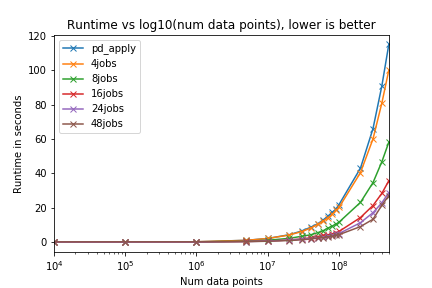

# Parapply

A simple drop-in replacement for parallelized pandas `apply()` on large Series / DataFrames, using `joblib`. Works by dividing the Series / DataFrame into multiple chunks and running `apply` concurrently. As a rule of thumb, use `parapply` only if you have 10 million rows and above (see benchmark below).

Install by running `pip install parapply`. Requires `joblib`, `numpy`, and `pandas` (obviously!)

## Simple Usage

Series: `parapply(srs, fun)` instead of `srs.apply(fun)`
DataFrames: `parapply(df, fun, axis)` instead of `df.apply(fun, axis)`

For more fine grain control:
    + `n_jobs` to decide number of concurrent jobs, 
    + `n_chunks` for number of chunks to split the Series / DataFrame

Examples:

```
import pandas as pd
import numpy as np
from parapply import parapply

# Series example
np.random.seed(0)
srs = pd.Series(np.random.random(size=(5, )))
pd_apply_result = srs.apply(lambda x: x ** 2)
parapply_result = parapply(srs, lambda x: x ** 2)
print(pd_apply_result)

# 0    0.301196
# 1    0.511496
# 2    0.363324
# 3    0.296898
# 4    0.179483
# dtype: float64

print(parapply_result)

# 0    0.301196
# 1    0.511496
# 2    0.363324
# 3    0.296898
# 4    0.179483
# dtype: float64

# DataFrame example with axis = 1
np.random.seed(1)
df = pd.DataFrame(data={
    'a': np.random.random(size=(5, )),
    'b': np.random.random(size=(5, )),
    'c': np.random.random(size=(5, )),
})

pd_apply_result = df.apply(sum, axis=1)
parapply_result = parapply(df, sum, axis=1)
print(pd_apply_result)

# 0    0.928555
# 1    1.591804
# 2    0.550127
# 3    1.577217
# 4    0.712960
# dtype: float64

print(parapply_result)

# 0    0.928555
# 1    1.591804
# 2    0.550127
# 3    1.577217
# 4    0.712960
# dtype: float64
```
Refer to docstrings for more information.

## Quick and dirty benchmarks

Ran a quick and dirty benchmark to compare time taken to apply `lambda x:x ** 2` to Series of varying length using pandas `apply` and `parapply` on multiple `n_jobs` settings:



This semilog plot above shows that significant runtime differences between pandas `apply` and `parapply` show up at 10 million data points and onwards. 


## Acknowledgements

Thanks to @aaronlhe for introducing me to the world of unit tests!